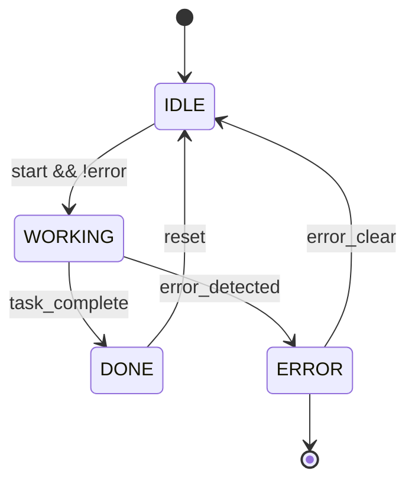
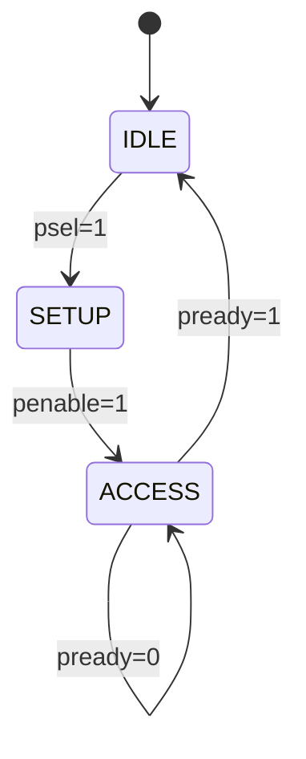
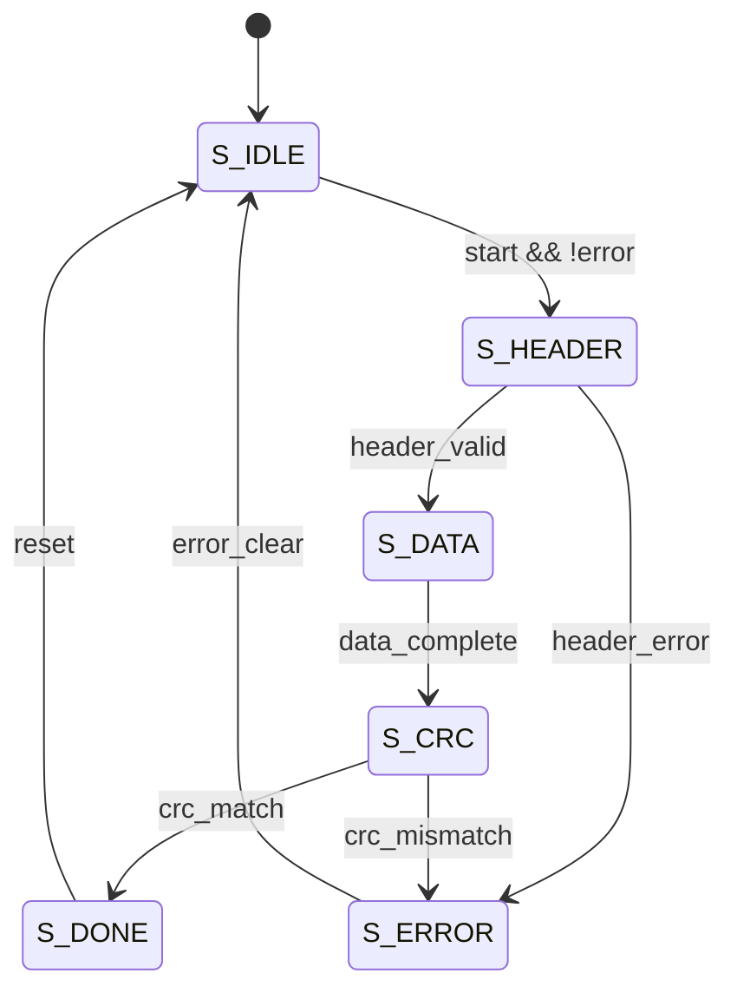
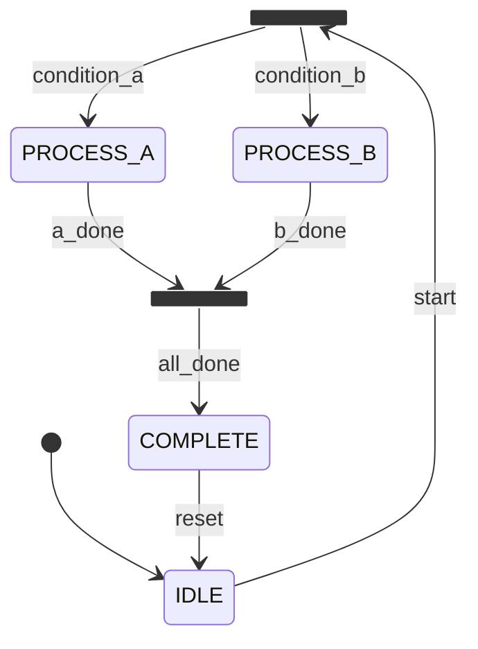
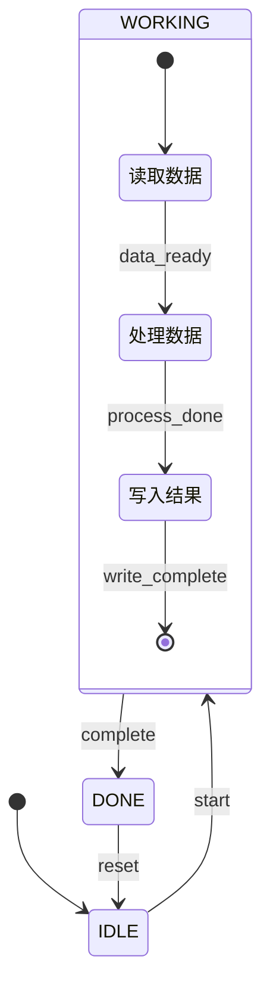
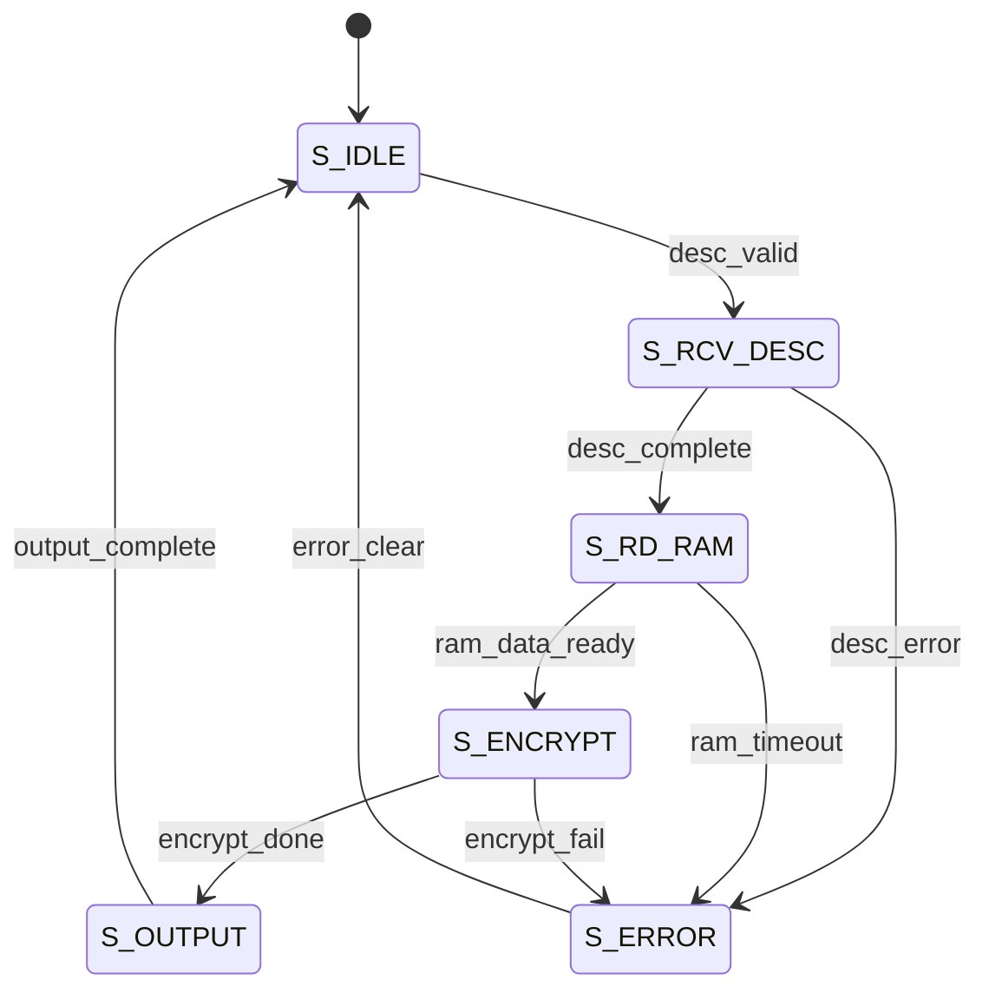
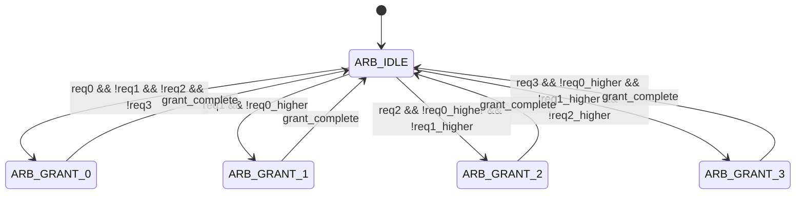
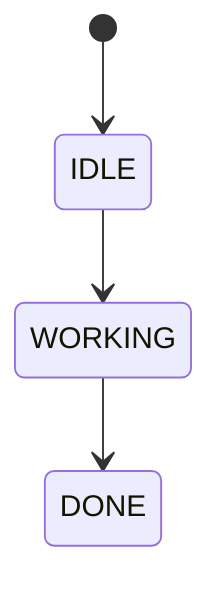
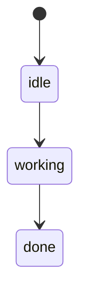
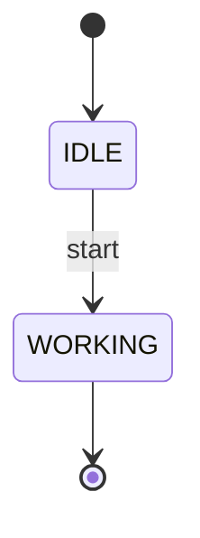

# Mermaid 状态图示例

> 本文档展示如何正确使用 Mermaid `stateDiagram-v2` 语法绘制芯片模块状态转移图。

---

## 1. 基本 FSM 状态转移图

### 示例 1：简单三状态 FSM

**说明**：
- `[*]` 表示初始状态和结束状态
- 箭头 `-->` 表示状态转移
- 冒号 `:` 后面是转移条件
- 状态名使用大写字母 + 下划线命名

### 示例 2：APB 总线状态机

**说明**：
- 展示 APB 协议的三状态 FSM
- 转移条件包含具体的信号条件
- 自环转移（ACCESS → ACCESS）表示等待状态

### 示例 3：带输出动作的状态机

**说明**：
- 包含错误处理路径（S_ERROR）
- 多个状态可以转移到错误状态
- 错误恢复路径清晰

---

## 2. 复杂状态机示例

### 示例 4：带并发状态的状态机

**说明**：
- `<<fork>>` 和 `<<join>>` 用于表示并发状态
- 适用于需要并行处理的场景

### 示例 5：带嵌套状态的状态机

**说明**：
- 使用 `state` 关键字定义复合状态
- 内部包含子状态机
- 适用于复杂的状态分组

---

## 3. 芯片模块专用示例

### 示例 6：数据通路控制 FSM

**说明**：
- 描述数据处理流水线的控制 FSM
- 每个状态对应数据通路的一个处理阶段
- 包含完整的错误处理和恢复路径

### 示例 7：仲裁器 FSM

**说明**：
- 四通道轮询仲裁器
- 转移条件包含优先级判断
- 每个授权状态完成後回到空闲状态

---

## 4. 最佳实践

### 4.1 命名规范
- 状态名：大写字母 + 下划线（如 `S_IDLE`, `S_WORKING`）
- 转移条件：使用信号名和逻辑表达式（如 `start && !error`）
- 避免使用中文状态名，使用英文缩写

### 4.2 布局建议
- 初始状态 `[*]` 放在顶部
- 主要处理流程从上到下
- 错误处理路径放在右侧
- 恢复路径使用虚线箭头（如适用）

### 4.3 语法要点
- 每个状态转移独占一行
- 转移条件放在冒号后面
- 使用 `-->` 而不是 `->`（Mermaid 语法要求）
- 确保所有状态都有进入和退出路径

### 4.4 验证方法
1. 将 Mermaid 代码粘贴到 [Mermaid Live Editor](https://mermaid.live/)
2. 检查是否能正确渲染
3. 验证所有状态转移是否完整
4. 确保没有孤立状态（除了 `[*]`）

---

## 5. 常见错误

### 5.1 语法错误

### 5.2 命名错误

### 5.3 缺少必要的状态

---

## 6. 与 RTL 编码规范的对应

### 6.1 状态编码
- 独热码（One-Hot）：状态数 ≤ 16
- 二进制编码：状态数 > 16
- 在 Mermaid 图中不需要指定编码，RTL 实现时使用 `localparam` 定义

### 6.2 两段式 FSM
- 段 1：时序逻辑存储当前状态（`state_cur`）
- 段 2：组合逻辑计算次态和输出（`state_nxt`）
- Mermaid 图描述的是段 2 的逻辑

### 6.3 复位行为
- 所有状态必须能从 `[*]` 进入
- 错误状态必须能回到 `IDLE`
- 禁止使用异步置位

---

## 7. 总结

使用 Mermaid `stateDiagram-v2` 语法绘制状态图的优势：

1. **标准化**：统一的图表格式，便于团队协作
2. **可渲染**：支持多种渲染器（GitHub、GitLab、VS Code、在线编辑器）
3. **版本控制友好**：文本格式，易于 diff 和 merge
4. **自动化验证**：可以集成到 CI/CD 流程中
5. **文档与代码一致**：状态图与 RTL 实现保持同步

记住：**所有状态转移图必须使用 Mermaid `stateDiagram-v2` 语法绘制**，这是项目编码规范的强制要求。